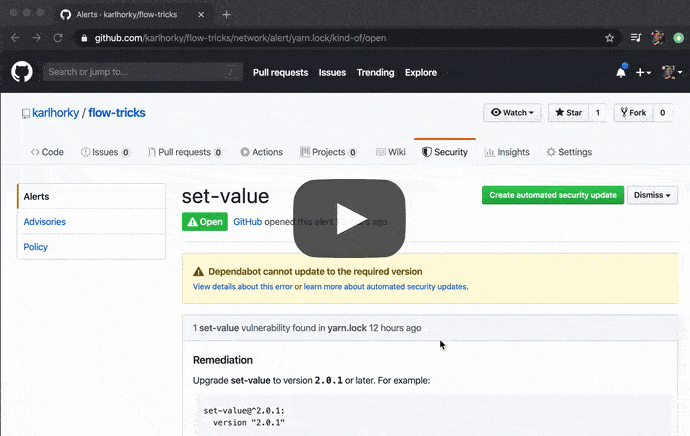

# Yarn.lock Security Fixes

> How to fix npm module security vulnerabilities in `yarn.lock` and `package.json`, including examples

Security advisories are becoming more prevalent in the JavaScript / TypeScript ecosystem, with GitHub, npm, Snyk and other companies constantly researching and publishing new security vulnerabilities.

In some cases, these fixes will be applied automatically by bots like [Dependabot](https://dependabot.com/) (built in to GitHub), [Renovate Bot](https://renovate.whitesourcesoftware.com/) ([**highly recommended!**](https://twitter.com/karlhorky/status/1245009)) or the [Snyk bot](https://support.snyk.io/hc/en-us/articles/360004032117-GitHub-scan-monitor-and-remediate). I definitely recommend setting these up first!

However, these bots are not always able to come up with an automated fix for a fixable security vulnerability:

- [Dependabot failures](https://twitter.com/karlhorky/status/1239183744625446919)
- [Snyk Bot failures](https://twitter.com/karlhorky/status/1244712138511351809)

It can be difficult to know what to do with these security vulnerabilities, especially for those with less experience with package managers and how dependencies are resolved by Yarn and npm.

This guide aims to help those with less experience apply security fixes with Yarn.

## Techniques

Depending on a number of factors in your project, the technique to fix a security vulnerability will be different.

In order to choose a technique below, first open the resources that we will need:

1. Open the security advisory page (the page on GitHub, Snyk, etc)
2. Open the `yarn.lock` file in the project in your editor

Refer to the security advisory page and collect some information:

3. Which version(s) are marked "vulnerable" by the security advisory? Use the advisory in the [Snyk Vulnerability Database](https://snyk.io/vuln/) if there is one - it is often more accurate than the GitHub Security Advisory pages.
4. Which **new version** is required for each affected version?

Switch to the `yarn.lock` file and collect the following information:

5. Which vulnerable version(s) are installed in your `yarn.lock`?
   
   Find the current version by searching for `<package name>@` and referring to the **next line** - the actual installed version is on the next line after `version: `.
6. For each of these vulnerable versions, check the semver version ranges on the line above (the numbers after `<package name>@`). Are all semver version ranges compatible with the corresponding new, fixed version? If you are unsure how to check compatibility, you can try the [npm semver version calculator](https://semver.npmjs.com/).
   
   If all the semver version ranges are compatible with the new version, congratulations, your project is in [State A](#state-a-new-version-compatible-with-existing-semver-ranges).
   
   If any of the version ranges are not compatible, your project is in [State B](#state-b-new-version-incompatible-with-existing-semver-ranges).

### State A. New Version Compatible with Existing Semver Ranges

#### Fix A1. Remove `yarn.lock` Entry and Running `yarn`

### State B. New Version Incompatible with Existing Semver Ranges

#### Fix B1. Upgrade Dependent

#### Fix B2. Forcing Incompatible Version Using Yarn Resolutions

## Examples

### `decompress`

#### `<4.2.1` - Arbitrary File Write Fix

Upgrade versions below `4.2.0` to `4.2.1`.

- **Advisory:** https://www.npmjs.com/advisories/1217/versions
- **GitHub PR:** https://github.com/kevva/decompress/pull/73#issuecomment-607268177

**Fix**

[Remove entry in `yarn.lock` and run `yarn`](https://github.com/karlhorky/yarn-lock-security-fixes/blob/master/README.md#1a-removing-yarnlock-entry-and-running-yarn)

https://github.com/karlhorky/gatsby-serverside-auth0/commit/fa44fb1b7a278ec066f9b8a9eb9f41b997b1287b

### `kind-of`

#### `>=6.0.0 <6.0.3` - Information Exposure

Upgrade versions between `6.0.0` and `6.0.2` to `6.0.3`.

- **Advisory:** https://snyk.io/vuln/SNYK-JS-KINDOF-537849
- **GitHub PR:** https://github.com/jonschlinkert/kind-of/pull/31

**Fix**

[Remove entry in `yarn.lock` and run `yarn`](https://github.com/karlhorky/yarn-lock-security-fixes/blob/master/README.md#1a-removing-yarnlock-entry-and-running-yarn)

https://github.com/karlhorky/next-offline-example/commit/66f2154680c45ff23af9628f33cefee1e4be3ad8
